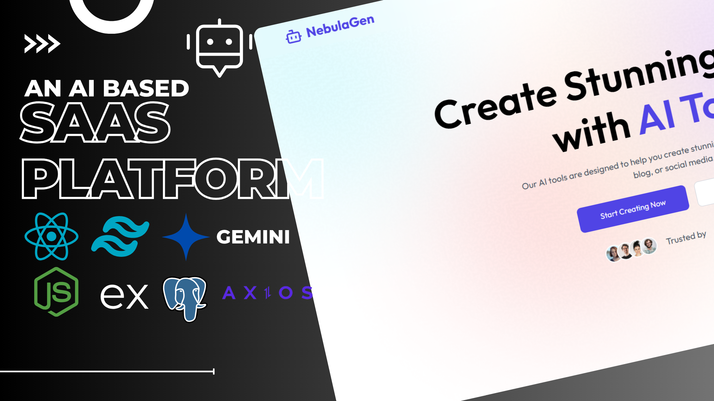
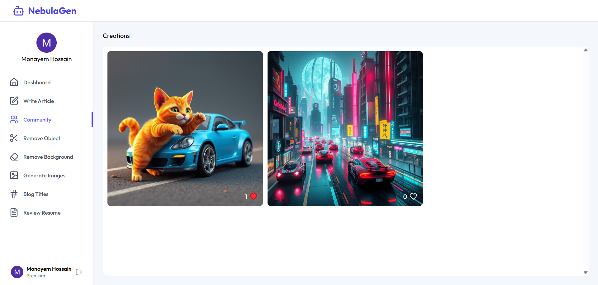
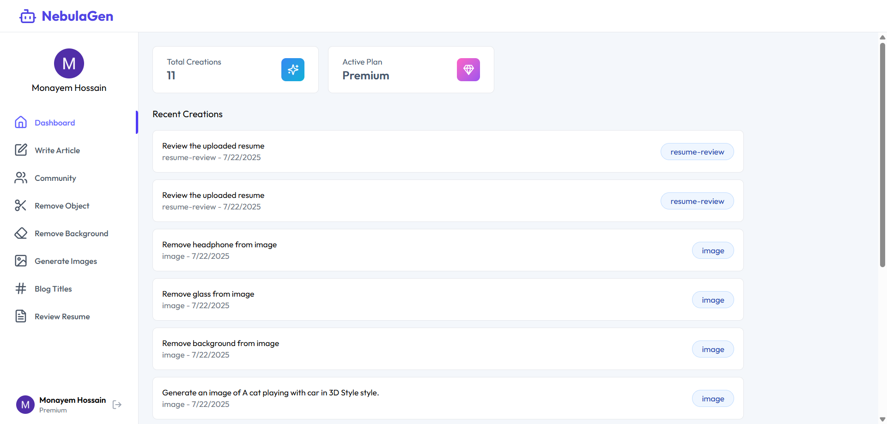

<div align="center">

    
               

</div>

# Saas Platform - NebulaGen



## Description


## Table of Contents

- [Features](#features)
- [Technologies Used](#technologies-used)
- [Installation](#installation)
- [Running the Application](#running-the-application)
- [API Integration](#api-integration)
- [Author](#author)

## Features

- **User Authentication:** Secure login and registration using Clerk.
- **Dashboard Overview:** Dashboard displaying with active plan and history.
- **Remove Background:** Remove backgrounds from images using AI-powered technology.
- **Remove Object:** Remove objects from images using AI-powered technology.
- **Generate Text:** Generate text using AI-powered technology.
- **Image:** Support for various image formats (JPEG, PNG, etc.).
- **Responsive Design:** Fully responsive interface utilizing Tailwind CSS.
- **Notifications:** User feedback with toast notifications using `react-hot-toast`.

## Demo

*Include screenshots or a link to the live demo here.*



## Technologies Used

- **React** — for building the frontend user interface.
- **Tailwind CSS** — for utility-first styling and responsive design.
- **Clerk** — for user authentication and registration.
- **React Hot Toast** — for toast notifications.
- **Lucide React** — for beautifully designed SVG icons.
- **React Router** — for client-side routing.
- **Axios** — for API communication.
- **Neon Database** - for the database service. 
- **Node.js** — for the backend server.
- **Express.js** — for building the backend server.
- **OpenAI** — for AI-powered services.




## Installation

1. **Clone the repository:**

    ```bash
    git clone https://github.com/Limon00001/NebulaGen.git
    ```

2. **Navigate to the project directory for client:**

    ```bash
    cd NebulaGen && cd client
    ```

3. **Install dependencies:**

    ```bash
    npm install
    ```

4. **Navigate to the project directory for server:**

    ```bash
    cd ../server
    ```

5. **Install dependencies:**

    ```bash
    npm install
    ```

## Running the Application

1. **Start the development server:**

   ```bash
   npm run dev
   ```

2. **Access the application:**

   Open your web browser and navigate to [http://localhost:5173](http://localhost:5173).

## Author

**Monayem Hossain Limon**

- GitHub: [@Limon00001](https://github.com/Limon00001)
- LinkedIn: [monayem-hossain-limon](https://linkedin.com/in/monayem-hossain-limon)
- Date: July 23, 2025

---

Feel free to star ⭐ this repository if you find it helpful!
